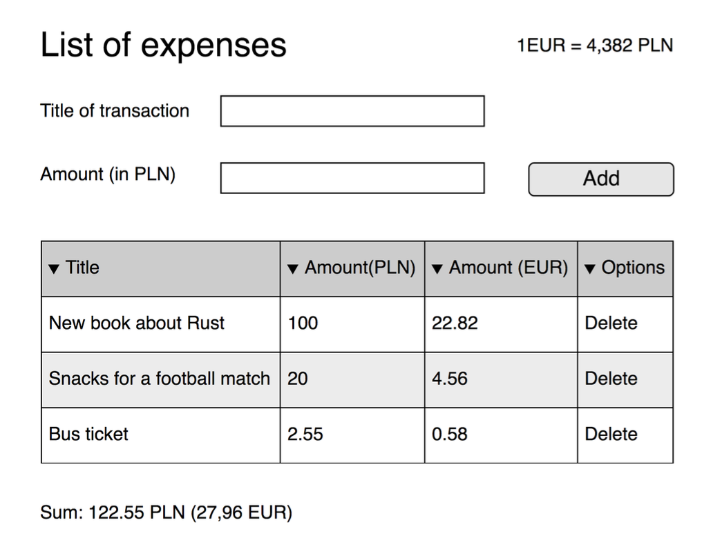

# Recruitment task for company X

Technologies should be used: react, mobx and TS.

## Task content

1. Title should have at least 5 characters.
2. Amount should accept at most two digits after the decimal point.
3. Add button should add a new item to the list.
4. Amount should be automatically recalculated into Euro.
5. User should be allowed to delete any item from the list.
6. The sum should be calculated automatically.
7. Optionally add possibility to change conversion rate.

## How to run the app

In the project directory, you can run:

### `npm start`

I have also deployed the app to vercel, you can check it here:

### [Create React App](https://github.com/facebook/create-react-app)

## Some explanations about code architecture, libraries etc. Why I decided to do some things like I did:

1. App is created in `CRA`, app don't needs any side rendering or routing, so it is perfect choice
2. For styling I have used `tailwind`, it is good for small apps and fast development
3. For forms, I have decided to use `react-hook-form`, it is one of the most popular forms library at the moment in react world.
4. This was first time when I have used `mobx`, I am not sure if I made the best decisions about its implementation, but final result looks good to me (from code and result perspective).
5. I didn't applied responsive design to this app, although styles are written in that way, that probably it needs a few small fixes to looks good on smaller devices.

